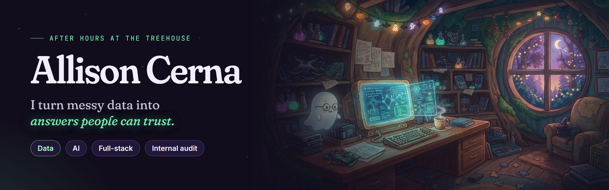

<!-- The banner follows your GitHub theme: After Hours in dark mode, Office Hours in light mode. -->
<picture>
  <source media="(prefers-color-scheme: light)" srcset="assets/banner-office-v2.png" />
  
</picture>

  <a href="https://www.linkedin.com/in/allisoncerna">LinkedIn</a> ·
  <a href="mailto:acerna2024@fau.edu">acerna2024@fau.edu</a>
  <!-- · <a href="https://allisoncerna.com">Portfolio</a>  (uncomment once the site is live) -->

I work across the whole data stack: **analysis, data science, AI, and full-stack**. At work I reconcile and analyze
spend data across a city's departments. In my projects I build the models, AI tools, and web apps that turn data into
answers people can trust.

> 🌙 **Try switching GitHub between light and dark mode.** The banner above has two moods, just like my portfolio.

### 🕯️ Right now

- **Forensic Accountant Intern, Internal Audit** at the City of Delray Beach, reconciling and analyzing multi-year spend data
- Studying for the **CIA** (Certified Internal Auditor)
- **B.S. Computer Science + Minor in AI** (Dec 2026) and **M.S. Data Science & Analytics** (Dec 2027) at Florida Atlantic University

### 🖥️ On the monitor

<table>
  <tr>
    <td width="50%" valign="top">
      <b><a href="https://github.com/allisoncerna/MuniciPAL-CAP6951-Team13">MuniciPAL</a></b> 
      RAG assistant for municipal policy · team lead  
      Answers questions about city ordinances and grant policy, with citations.  
      <b>90%</b> Precision@1 · <b>100%</b> Hit@5 · 68 city documents  
      <code>Python</code> <code>ChromaDB</code> <code>Gemini API</code> <code>RAG evaluation</code>
    </td>
    <td width="50%" valign="top">
      <b><a href="https://github.com/allisoncerna/The-Midnight-Spirit-Patisserie">The Midnight Spirit Patisserie</a></b> 
      Explainable fraud detection  
      A neural network flags suspicious transactions, then Gemini writes a forensic memo explaining why.  
      <b>97.5%</b> validation accuracy · 3 tuning experiments  
      <code>Python</code> <code>TensorFlow</code> <code>scikit-learn</code> <code>Gemini API</code>
    </td>
  </tr>
  <tr>
    <td width="50%" valign="top">
      <b><a href="https://github.com/GOST-Capstone-2026/usdr-gost-capstone">Grant Compliance Assistant</a></b> 
      AI grant tooling for cities · evaluation & QA  
      Extends USDR's open-source Grants One Stop Tool. I built the PostgreSQL schemas, Grants.gov integrations, and
      the QA framework that measures AI extraction accuracy.  
      <code>PostgreSQL</code> <code>Node.js</code> <code>REST APIs</code> <code>LLM evaluation</code>
    </td>
    <td width="50%" valign="top">
      <b><a href="https://github.com/allisoncerna/Data-Science-Portfolio/tree/main/corporate-retail-analysis">Corporate Retail Analysis</a></b> 
      SQL + Tableau  
      Cleaned a messy multi-brand retail export into 2,175 verified records, then found where margin was leaking.  
      <b>19.8%</b> return rate traced to sizing, not quality  
      <code>MySQL</code> <code>Excel</code> <code>Tableau</code> <code>Data cleaning</code>
    </td>
  </tr>
  <tr>
    <td width="50%" valign="top">
      <b>Manor of Mischief</b> 
      Halloween party invite · live link returns after Halloween  
      A single-page invite whose RSVP form writes straight into a Google Sheet. No server, no database.  
      <code>Vite</code> <code>JavaScript</code> <code>Google Apps Script</code> <code>Netlify</code>
    </td>
    <td width="50%" valign="top">
      <b><a href="https://allisoncerna.github.io/Web101Project/">XP Boost: Survive Your First Con</a></b> 
      My first website  
      A multi-page anime convention guide with a validated RSVP form, dark mode, and a Reduce Motion toggle.  
      <code>HTML</code> <code>CSS</code> <code>JavaScript</code>
    </td>
  </tr>
</table>

### 🧪 The potion shelf

| Potion | Ingredients |
| :--- | :--- |
| 🟢 **Analysis** | Python (Pandas, NumPy, scikit-learn) · SQL (MySQL, PostgreSQL, SQLite) · Excel (Power Pivot, modeling) · statistics |
| 🟣 **AI** | RAG · ChromaDB · sentence-transformers · TensorFlow · Gemini API · prompt engineering · explainable AI |
| 🟠 **Building** | JavaScript · TypeScript · HTML/CSS · Astro · Express.js · Vite · Google Apps Script |
| 🔵 **Visualization & tools** | Tableau · Matplotlib · Seaborn · Git · VS Code · Jupyter · Colab · Vercel · Netlify |

### 👻 Beyond the code

- **Former SFX makeup artist for haunted houses**, so yes, my projects tend to be a little spooky.
- Years in customer-facing roles taught me to stay calm under pressure and explain technical findings to anyone.
- I like spotting what teammates are great at and helping them lean into it.
- Off the clock: writing, cosplay, anime, and board game nights.

> [!TIP]
> **Hiring?** I'm open to **data analyst, data science, AI, and internal audit** roles.
> [Email me](mailto:acerna2024@fau.edu) or [connect on LinkedIn](https://www.linkedin.com/in/allisoncerna).
